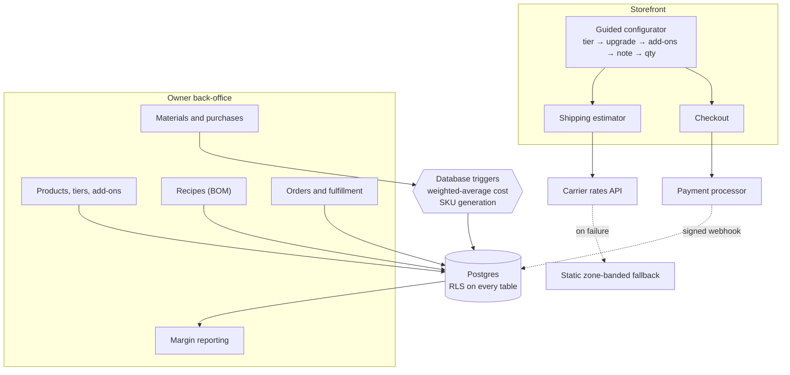

# Violet-Rays

**Direct-to-consumer e-commerce with real inventory accounting.** Architecture case study. Source is private.

A storefront for a boutique physical-goods brand, plus an owner back-office that tracks materials, recipes, purchase costs, fulfillment, and per-product margin. The interesting half is not the checkout. It is that a configurable product has to decrement the correct raw materials and report an honest margin.

Self-directed personal project, 2026. I designed the schema, the cost model, the security posture, and the shipping economics, and directed the implementation with AI tooling. This document is the reasoning, not the code.

---

## The problem

Most small-business storefronts treat inventory as a number next to a product. That works until the product is configurable. A three-tier product with upgrades and add-ons is not one item, it is a different bill of materials per configuration, and the materials are shared across products.

If margin is computed from a price minus a guess, it drifts, and nobody finds out until the year is over. So the cost model had to be enforced somewhere a forgetful code path cannot bypass.

---

## Architecture

**The configurator is the fulfillment spec.** Choosing a tier, an upgrade, and add-ons does not just set a price. It determines the bill of materials and the shipping class. Quick add-to-cart was removed deliberately, because a purchase without a configuration is an order nobody can fulfill.

**Cost accounting lives in the database.** Purchases recompute weighted-average material cost through triggers on receipt. A stock-adjustment ledger records every inventory movement for auditability. Margin reporting reads from tier-level bill-of-materials cost rather than from an estimate typed into a field.

**Tier recipes fall back to a base recipe.** A recipe can be defined per tier, or left unset to inherit the product's base recipe. Adding a fourth tier does not require backfilling every product.

**Shipping degrades gracefully.** Live carrier rates with a static zone-banded fallback by postal prefix, so the estimator gives an answer even when the carrier API does not.

---

## The shipping decision

Carrier dimensional-weight pricing charges by the larger of actual weight and volumetric weight. The product's packed volume sat just above a threshold, and the obvious response was to raise prices to absorb the fee.

I modeled it instead. Trimming one product dimension brought the parcel under the threshold and cut projected standard shipping cost by roughly half, with no price increase and no change to what the customer receives. The cheapest fix was in the packaging, not the pricing.

That analysis also drove the tier structure and the price points, and quantified the impact of an upcoming change to the carrier's volumetric divisor before it took effect.

---

## Security posture

- **Row-level security on every table**, with public read limited to active listings, operational writes limited to the owner, and order data readable only by the owner.
- **Single-owner write model, chosen deliberately.** This is a single-tenant store. A per-user policy model would add complexity with no additional protection, and I accepted the tooling warnings that come with that choice rather than adding machinery for a tenant that does not exist.
- **Payment webhooks reconcile totals server-side.** The client never establishes what an order was worth.
- **Constraints and generated identifiers at the database layer**, so referential integrity and SKU uniqueness do not depend on application code being correct.
- **A middleware passcode gate** let the owner validate in production before launch, with the payment webhook route exempted so real callbacks were never blocked.

---

## Trade-offs

See [DECISIONS.md](DECISIONS.md) for the decisions I made, what I gave up, and what would make me revisit each one.

---

## Stack

Next.js 14 (App Router) · React · Tailwind · Supabase (Postgres, Auth, Storage, RLS, triggers) · Stripe Checkout and webhooks · Shippo · Vercel

---

*Personal project, built for learning. © 2026 Deni Mullican.*
